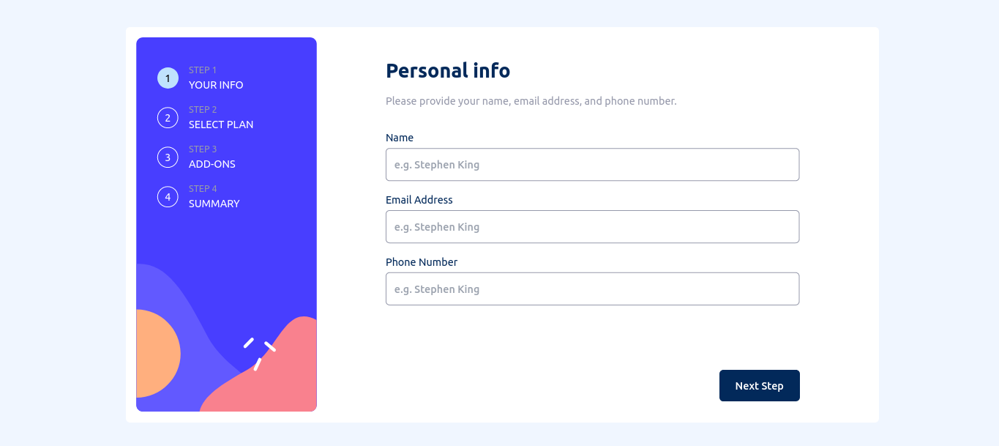

# Frontend Mentor - Multi-step form solution

This is a solution to the [Multi-step form challenge on Frontend Mentor](https://www.frontendmentor.io/challenges/multistep-form-YVAnSdqQBJ). Frontend Mentor challenges help you improve your coding skills by building realistic projects.

## Table of contents

- [Overview](#overview)
  - [The challenge](#the-challenge)
  - [Screenshot](#screenshot)
  - [Links](#links)
- [My process](#my-process)
  - [Built with](#built-with)
  - [What I learned](#what-i-learned)
  - [Useful resources](#useful-resources)

## Overview

### The challenge

Users should be able to:

- Complete each step of the sequence
- See a summary of their selections on the final step and confirm their order
- View the optimal layout for the interface depending on their device's screen size
- See hover and focus states for all interactive elements on the page

### Screenshot



### Links

- Live Site URL: [https://multi-step-form-rahul.vercel.app/](https://multi-step-form-rahul.vercel.app/)

## My process

### Built with

- [React.js](https://reactjs.org/) - JS library
- [Tailwind CSS](https://tailwindcss.com/) - For styles

### What I learned

- JavaScript Array reduce() Method

```js
const totalPrice =
  selectedPlan.price +
  selectedAddOns.reduce((total, addOn) => {
    return total + addOn.price;
  }, 0);
```

- Tailwind CSS

### Useful resources

- [React.js](https://reactjs.org/)
- [Tailwind CSS](https://tailwindcss.com/)
